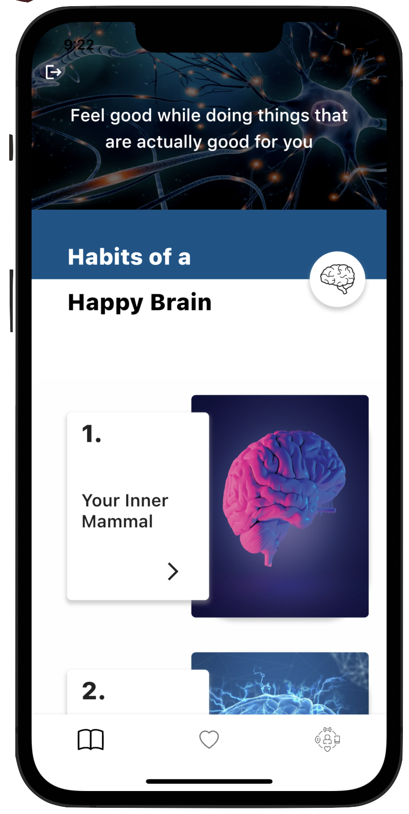
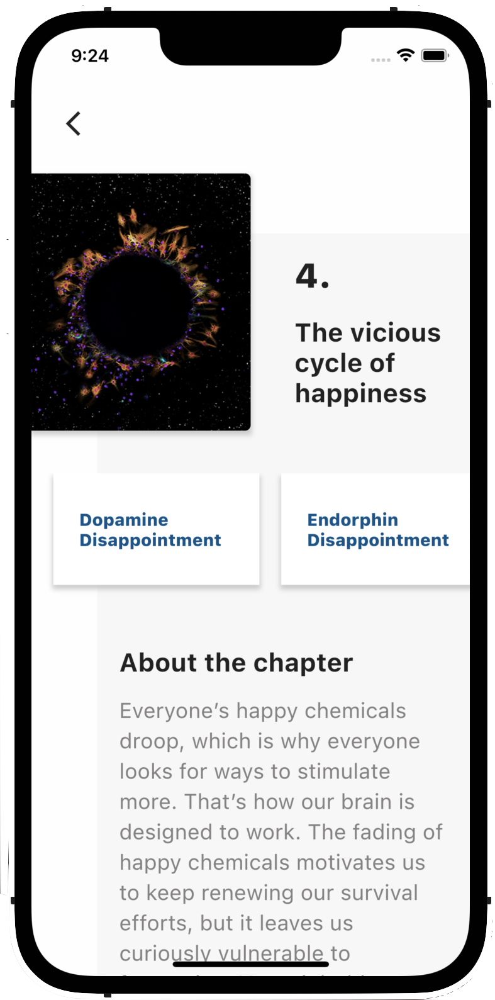
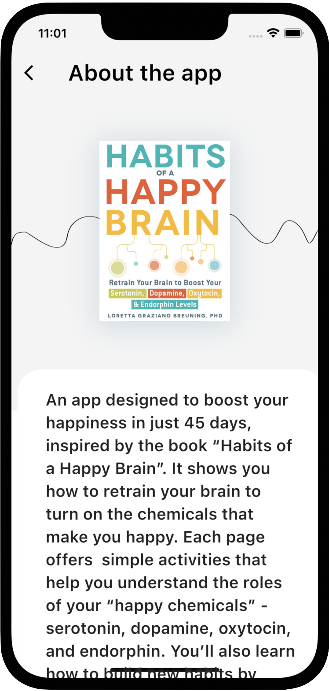
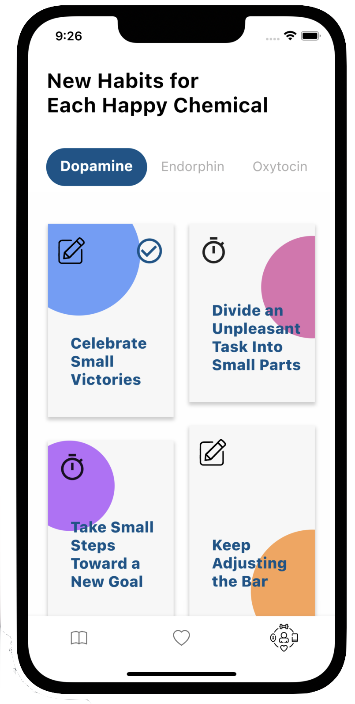
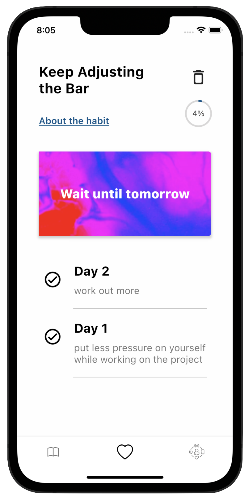
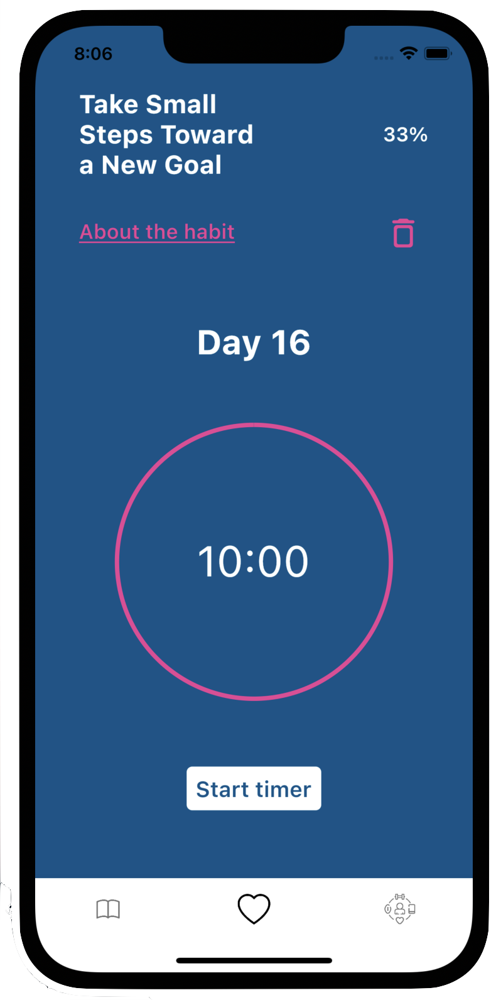
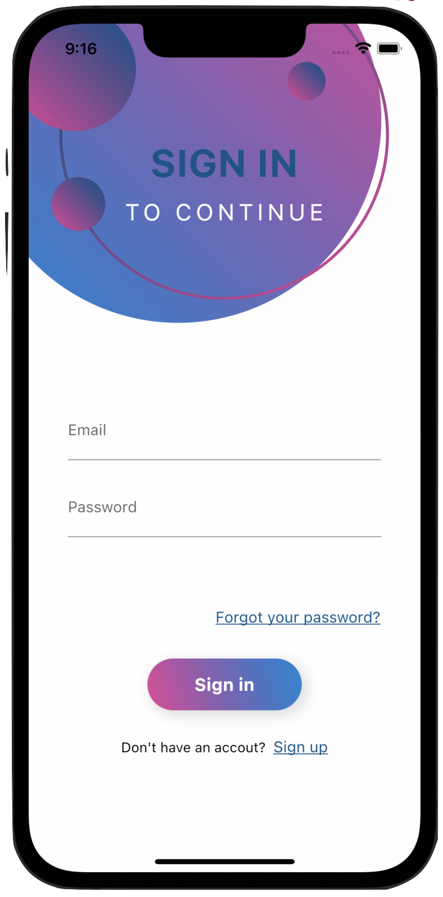
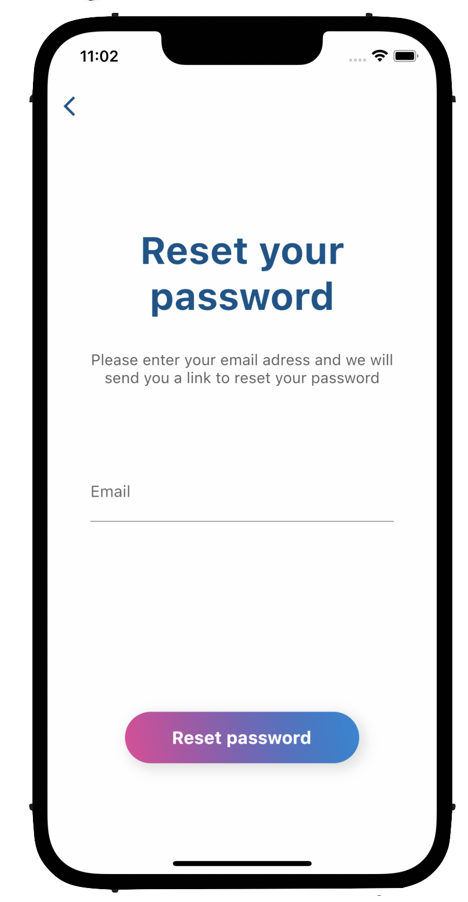

# Habits of a Happy Brain 

#### Aplicatie dezvoltata cu scopul de a-ti creste nivelul de fericire in doar 45 de zile

## Tehnologii utilizate

* Flutter Framework
* Firebase 

## Descriere

Aplicatia are rolul de a prezenta felul in care functioneaza creierul si factorii declansatori ai substantelor chimice pe care le contine, fiind demonstrat modul in care serotonina, dopamina, oxitocina și endorfina, au un adevarat impact asupra nivelului de fericire. 

Partea sa aplicativa consta in dezvoltarea unui obicei pe parcursul a 45 de zile prin care va puteti activa hormonii fericirii, fiind ghidati de aplicatie pentru a-l dezvolta intr-un mod corect.

  
   
  

  
  
   

  
    
    

## Componente preluate

* fotografii: de pe internet
* text: din cartea "Habits of a Happy Brain "

